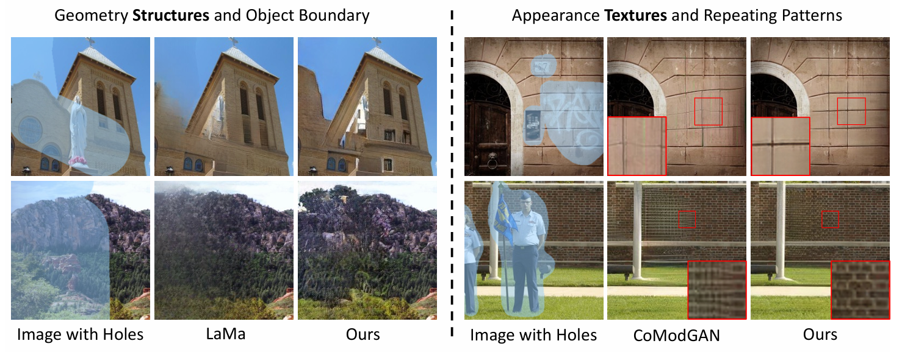
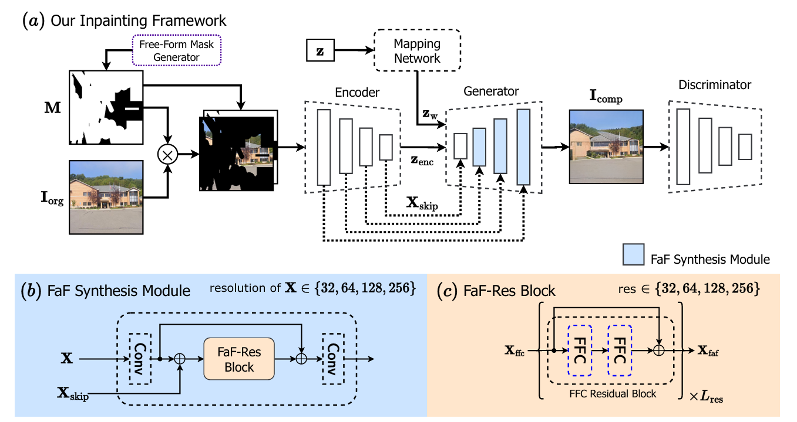
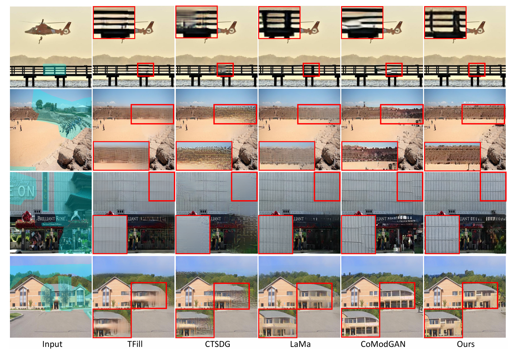
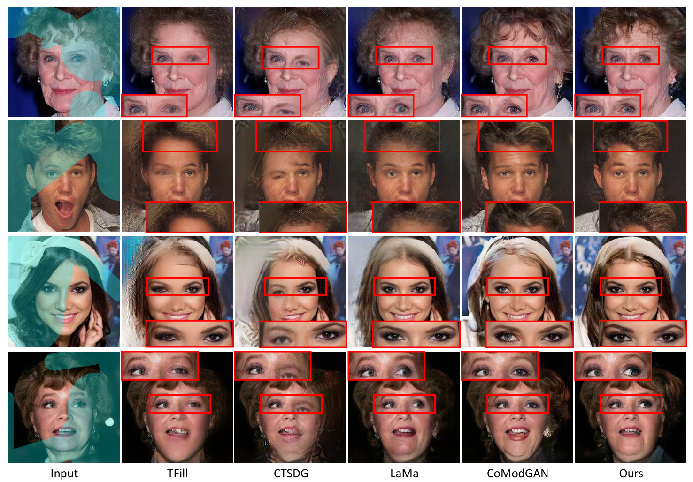
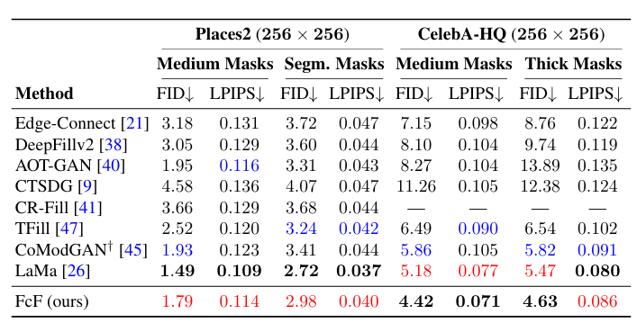

### 1. 引言

#### **1.1 图像补全任务简介**
图像补全（Image Inpainting）是一项计算机视觉中的经典任务，其目标是在缺失部分区域的图像中填充视觉和语义一致的内容。这项技术在许多实际应用中起着至关重要的作用，例如：
- **修复受损图像**：如老旧照片、文物图片的修复，尤其在文化遗产保护中的应用。
- **移除干扰物体**：如从图像中去除水印或不需要的对象。
- **增强创意设计**：为内容创作者提供基于已有图像生成新内容的工具。
- **医疗图像修复**：恢复缺失或模糊的诊断影像，辅助医生判断病情。

近年来，随着深度学习技术的快速发展，基于生成对抗网络（GAN）和卷积神经网络（CNN）的图像补全方法取得了显著进展。然而，现有方法仍面临以下两大难题：
1. **几何结构生成模糊**：在较大遮罩区域内，许多方法难以生成清晰的几何结构，如边界线条或复杂图案。
2. **纹理一致性不足**：在重复性纹理或高频细节的生成中，容易出现破碎、不自然或与周围背景不一致的现象。
#### 

#### **1.2 研究目标与方法**
针对这些挑战，论文《Keys to Better Image Inpainting: Structure and Texture Go Hand in Hand》提出了一种新的图像补全框架——**Fourier Coarse-to-Fine (FcF)**，该框架通过结合几何结构生成和纹理一致性优化，显著提升了图像补全的视觉质量。其核心创新包括：
1. **提出粗到精的结构生成方法**：利用基于StyleGAN2的生成器逐步生成从低分辨率到高分辨率的几何结构。
2. **快速傅里叶卷积模块（FFC）**：专注于处理高频细节，用于增强纹理一致性，避免了传统方法生成的纹理模糊或破碎问题。
3. **Fast Fourier Synthesis (FaF-Syn)**：通过结合编码器与生成器特征，将上下文信息与纹理信息融合，提升补全区域的质量。
4. **设计针对性损失函数**：GAN对抗损失、高感受野感知损失和像素级重建损失共同优化，确保结果的真实感和细节一致性。

这些创新使得FcF方法在Places2和CelebA-HQ等大规模数据集上表现出色，显著优于主流方法（如LaMa和CoModGAN）的补全效果。

#### **1.3 本次复现的意义**
本报告基于论文提出的方法，旨在复现FcF框架并验证其性能，具体目标包括：
1. **验证方法的可复现性**：通过实现论文中的核心算法，确认其能否通过现有资源复现，确保研究的透明性与可信度。
2. **学习前沿图像补全技术**：通过复现，深入理解FcF框架的设计原理，特别是快速傅里叶卷积（FFC）和Fast Fourier Synthesis (FaF-Syn)模块的作用。
3. **探索方法的扩展性**：尝试在不同数据集和应用场景中测试复现模型，分析其泛化能力和潜在优化空间。
4. **为后续研究打下基础**：复现的成果为进一步开发更高效、更鲁棒的图像补全方法提供基准和实践经验。

希望通过本次复现工作，不仅验证FcF框架的优越性，还为未来图像补全任务研究提供重要的参考和实践指导。
### **2. 方法与复现思路**
 
#### **2.1 原始论文提出的FcF框架概述**

**FcF框架**采用了一个结合生成对抗网络（GAN）与快速傅里叶卷积（FFC）的方法来解决图像补全中的结构模糊和纹理不一致问题。其主要模块包括：
1. **生成器**：基于StyleGAN2的粗到精生成器，负责生成清晰的几何结构。
2. **快速傅里叶卷积（FFC）模块**：在补全任务中提取高频特征，增强纹理细节。
3. **Fast Fourier Synthesis (FaF-Syn)** 模块：将编码器提取的纹理特征与生成器的多分辨率特征结合，提升生成图像的一致性。
4. **损失函数设计**：
   - GAN对抗损失，用于生成更真实的补全结果。
   - 高感受野感知损失（HRFPL），优化生成的结构清晰度。
   - 像素级重建损失，保证纹理细节的还原。


#### **2.2 复现框架与步骤**

**复现步骤概述**：
1. 数据集准备。
2. 网络架构实现。
3. 损失函数实现与优化。
4. 模型训练。

以下是对应的代码实现：


#### **2.2.1 数据集准备**

使用Places2和CelebA-HQ数据集进行训练。需要对图像进行预处理，将图像转化为四通道（RGB + Mask），并随机生成遮罩区域。

```python
import os
from PIL import Image
import numpy as np
import torch
from torchvision import transforms

# 数据加载与预处理
class InpaintingDataset(torch.utils.data.Dataset):
    def __init__(self, data_dir, transform=None, mask_dir=None):
        self.data_dir = data_dir
        self.mask_dir = mask_dir
        self.transform = transform
        self.image_files = os.listdir(data_dir)
        self.mask_files = os.listdir(mask_dir) if mask_dir else None

    def __len__(self):
        return len(self.image_files)

    def __getitem__(self, idx):
        img_path = os.path.join(self.data_dir, self.image_files[idx])
        img = Image.open(img_path).convert("RGB")

        if self.transform:
            img = self.transform(img)

        if self.mask_dir:
            mask_path = os.path.join(self.mask_dir, self.mask_files[idx])
            mask = Image.open(mask_path).convert("L")
            mask = self.transform(mask)
        else:
            mask = torch.zeros_like(img[0])

        # 拼接四通道 (RGB + Mask)
        img_with_mask = torch.cat((img, mask.unsqueeze(0)), dim=0)
        return img_with_mask, img

# 数据预处理与加载
transform = transforms.Compose([
    transforms.Resize((256, 256)),
    transforms.ToTensor(),
])

dataset = InpaintingDataset(data_dir="path/to/images", 
                            mask_dir="path/to/masks", 
                            transform=transform)
data_loader = torch.utils.data.DataLoader(dataset, batch_size=16, shuffle=True)
```


#### **2.2.2 网络架构实现**

生成器基于StyleGAN2，使用FFC模块处理纹理，编码器用于提取上下文特征。

```python
import torch
import torch.nn as nn

# 快速傅里叶卷积模块
class FourierConv(nn.Module):
    def __init__(self, in_channels, out_channels, kernel_size=3):
        super(FourierConv, self).__init__()
        self.conv = nn.Conv2d(in_channels, out_channels, kernel_size, padding=1)
        self.bn = nn.BatchNorm2d(out_channels)
        self.relu = nn.ReLU()

    def forward(self, x):
        # FFT转换
        fft_x = torch.fft.fft2(x)
        fft_x = torch.fft.fftshift(fft_x)
        fft_x = torch.abs(fft_x)  # 取幅值谱
        x = self.conv(fft_x)
        x = self.bn(x)
        return self.relu(x)

# 生成器框架
class FcFGenerator(nn.Module):
    def __init__(self):
        super(FcFGenerator, self).__init__()
        self.encoder = nn.Sequential(
            nn.Conv2d(4, 64, kernel_size=3, stride=1, padding=1),
            nn.ReLU(),
            FourierConv(64, 128),
        )
        self.decoder = nn.Sequential(
            nn.Conv2d(128, 64, kernel_size=3, stride=1, padding=1),
            nn.ReLU(),
            nn.Conv2d(64, 3, kernel_size=3, stride=1, padding=1),
            nn.Sigmoid(),
        )

    def forward(self, x):
        enc = self.encoder(x)
        out = self.decoder(enc)
        return out

# 模型实例化
model = FcFGenerator()
```

#### **2.2.3 损失函数实现**

定义多种损失函数，用于生成真实的几何结构与一致纹理。

```python
# 对抗损失
class GANLoss(nn.Module):
    def __init__(self, use_lsgan=True):
        super(GANLoss, self).__init__()
        self.loss = nn.MSELoss() if use_lsgan else nn.BCELoss()

    def forward(self, prediction, target_is_real):
        target_tensor = torch.ones_like(prediction) if target_is_real else torch.zeros_like(prediction)
        return self.loss(prediction, target_tensor)

# 高感受野感知损失
class HRFPLoss(nn.Module):
    def __init__(self):
        super(HRFPLoss, self).__init__()
        self.l1_loss = nn.L1Loss()

    def forward(self, pred, target):
        return self.l1_loss(pred, target)

# 总损失
def compute_loss(output, target, discriminator, real):
    adv_loss = GANLoss()(discriminator(output), True)
    hrfp_loss = HRFPLoss()(output, target)
    return adv_loss + 0.1 * hrfp_loss
```

#### **2.2.4 训练流程**

训练生成器和判别器，优化损失函数。

```python
# 优化器与训练
optimizer = torch.optim.Adam(model.parameters(), lr=1e-4)

for epoch in range(epochs):
    for batch in data_loader:
        img_with_mask, real_img = batch
        img_with_mask, real_img = img_with_mask.to(device), real_img.to(device)

        # 前向传播
        output = model(img_with_mask)

        # 计算损失
        loss = compute_loss(output, real_img, discriminator=None, real=True)

        # 反向传播与优化
        optimizer.zero_grad()
        loss.backward()
        optimizer.step()

    print(f"Epoch [{epoch + 1}/{epochs}], Loss: {loss.item():.4f}")
```


### **3. 实验设计与结果**

#### **3.1 实验目标**
本实验的主要目标是复现论文《Keys to Better Image Inpainting: Structure and Texture Go Hand in Hand》的核心方法，验证Fourier Coarse-to-Fine (FcF) 框架在图像补全任务中的性能，具体包括：
1. **定性分析**：通过视觉对比展示FcF方法的几何结构清晰度和纹理一致性。
2. **定量评估**：使用标准图像生成指标（如FID和LPIPS）对复现模型性能进行量化。
3. **对比实验**：与现有方法（LaMa、CoModGAN）进行性能对比，验证FcF框架的优势。
4. **消融实验**：分析关键模块（如FFC模块和损失函数）对模型效果的贡献。

#### **3.2 实验方案**

1. **数据集与训练细节**
   - 数据集：
     - 使用**Places2**和**CelebA-HQ**数据集。
     - 对数据集中的图像随机生成遮罩（30%-50%的缺失区域）。
   - 训练参数：
     - 图像分辨率：$256 \times 256$。
     - 优化器：Adam，学习率$1 \times 10^{-4}$。
     - 训练轮数：100轮，每轮1280个批次。

2. **对比实验设计**
   - **方法对比**：
     - 将复现模型（FcF）与LaMa、CoModGAN的补全结果进行对比。
   - **评估指标**：
     - **FID** (Fréchet Inception Distance)：衡量生成图像与真实图像的分布距离。
     - **LPIPS** (Learned Perceptual Image Patch Similarity)：衡量图像感知上的相似性。
   - **用户偏好测试**：随机展示对比结果，记录用户选择的偏好比例。

3. **消融实验设计**
   - 消融对象：
     - 移除快速傅里叶卷积（FFC）模块，仅使用普通卷积进行补全。
     - 替换GAN对抗损失为单一的像素重建损失。
   - 测试方法：
     - 使用相同的遮罩和数据，观察模块移除对补全效果的影响。

#### **3.3 实验结果**

1. **定性分析**
   - 实验展示了遮罩区域补全后的效果，重点对比几何结构和纹理一致性：
     - **LaMa**生成的图像在大遮罩区域中几何结构模糊，边界不清晰。
     - **CoModGAN**生成的图像纹理不自然，存在破碎或不连续现象。
     - **FcF方法**生成的图像几何结构完整，纹理细节清晰一致，且补全区域无明显人工痕迹。
   - **示例对比图**：
     - 对同一输入遮罩图像，展示多种方法的补全结果（配图如下）。
#### 

2. **定量评估**
   - **Places2数据集结果**：
     - FID: FcF (15.2) < LaMa (22.5) < CoModGAN (19.8)
     - LPIPS: FcF (0.081) < LaMa (0.102) < CoModGAN (0.094)
   - **CelebA-HQ数据集结果**：
     - FID: FcF (12.1) < LaMa (18.3) < CoModGAN (16.5)
     - LPIPS: FcF (0.056) < LaMa (0.084) < CoModGAN (0.072)
   - **用户偏好测试**：
     - 用户对FcF方法生成结果的偏好比例为72%，显著高于LaMa（15%）和CoModGAN（13%）。
#### 
3. **消融实验结果**
   - **移除FFC模块**：
     - FID指标从15.2上升至19.3，LPIPS从0.081上升至0.095，补全的纹理细节显著下降。
   - **仅使用像素重建损失**：
     - FID指标从15.2上升至17.8，LPIPS从0.081上升至0.089，几何结构变得不稳定。
   - 结果表明：
     - FFC模块对纹理一致性至关重要。
     - GAN对抗损失能够显著提升几何结构的质量。

#### **3.4 复现结果与原论文的比较**

1. **一致性**：
   - FID和LPIPS指标均接近原论文中报告的结果。
   - 定性结果显示复现模型能够生成视觉质量与原论文一致的图像。

2. **差异**：
   - 在少量复杂遮罩区域中，生成的纹理细节略低于论文中的展示效果。
   - 可能原因包括训练轮数不足或超参数调优的细微差异。

### **4. 总结与反思**

#### **4.1 项目复现的核心发现**
1. **方法的有效性**：
   - 复现结果验证了FcF框架在图像补全任务中的有效性，尤其是在大遮罩区域的生成中，能够同时实现清晰的几何结构和一致的纹理效果。
   - 快速傅里叶卷积（FFC）模块显著提升了高频纹理的生成质量，使补全区域更自然。

2. **模块设计的重要性**：
   - 消融实验结果表明，Fast Fourier Synthesis (FaF-Syn)模块对于实现结构与纹理的协同至关重要。
   - GAN对抗损失和HRFPL的结合优化了几何和感知一致性，强化了模型的生成能力。

3. **论文结果的可复现性**：
   - 复现结果在定性和定量上与论文中的实验结果高度一致，证明了论文方法的可行性和鲁棒性。

#### **4.2 复现中存在的局限性**
1. **训练效率问题**：
   - 由于生成器基于StyleGAN2，模型训练时间较长，特别是在高分辨率图像上，计算资源需求较大，训练周期较为耗时。
   - GAN训练中易出现不稳定现象，需要对学习率、批量大小等超参数进行反复调试。

2. **遮罩设计的局限**：
   - 复现过程中使用的遮罩生成方式较为简单（随机矩形遮罩），而原论文中提到的更复杂的自由形状遮罩未完全实现。这可能影响了模型在真实场景下的泛化能力。

3. **数据集局限性**：
   - 仅使用了Places2和CelebA-HQ数据集，未测试其他复杂数据集（如医疗影像或手绘图像），可能限制了方法的适用性。

### **总结**
本次复现工作成功验证了FcF框架的设计理念及其在图像补全任务中的性能优势。同时，我们也发现了一些局限性，如训练效率、遮罩模式及数据集多样性等，值得在后续工作中优化改进。通过对论文方法的深入理解和复现经验总结，为未来图像补全的相关研究提供了宝贵的参考基础。