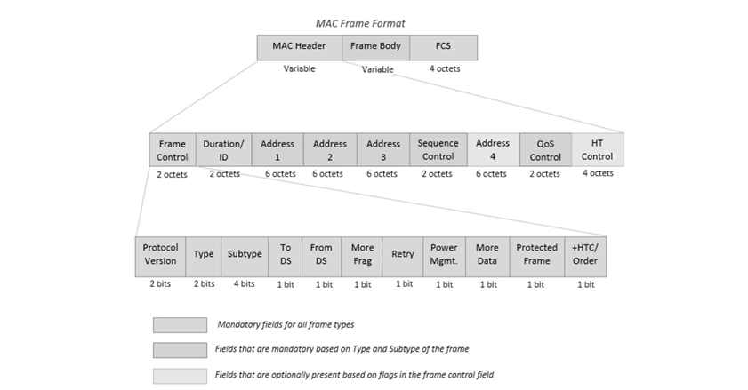
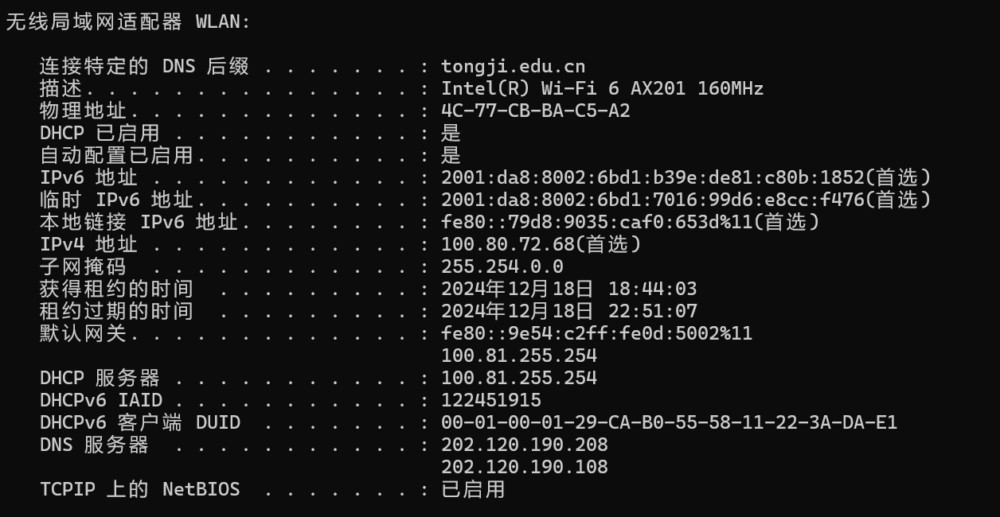
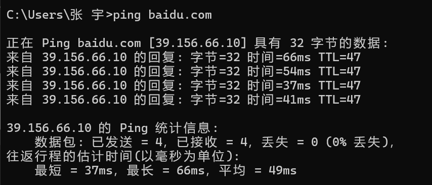
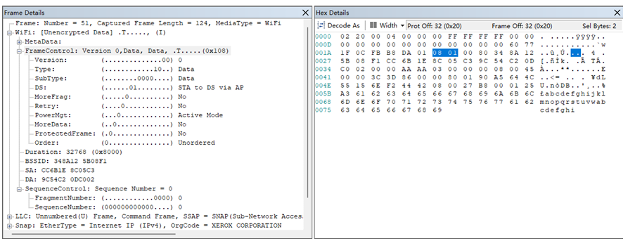

## **1. 无线局域网简介**

无线局域网（**Wireless Local Area Network, WLAN**）是一种利用无线电波、红外线等无线传输技术代替传统有线网络连接的局域网。它采用无线通信技术实现设备之间的数据传输和资源共享，主要应用于移动设备和不便布线的环境。  
WLAN 最常用的标准是 IEEE **802.11 系列协议**，包括了多种网络传输的细节与管理规则。

### **1.1 无线局域网的特点**
1. **灵活性**：设备可以在无线信号覆盖范围内自由移动。
2. **易于部署**：无需布线，网络部署方便快捷。
3. **适应性强**：适用于家庭、企业、公共场所等多种场景。
4. **可扩展性**：易于增加新的无线设备。

### **1.2 无线局域网中的 MAC 帧**
无线局域网的 MAC 帧（**Medium Access Control Frame**）是 IEEE 802.11 协议的核心组成部分。它包含了数据传输的头部控制信息和有效载荷，主要用于在无线信道上传输数据，并确保数据传输的可靠性和安全性。  
根据 IEEE 802.11 标准，MAC 帧主要分为以下三类：  
- **管理帧**：用于设备的加入、退出和网络管理，例如关联请求、探测请求等。  
- **控制帧**：用于传输的控制管理，如发送确认 (ACK) 和清空信道 (RTS/CTS) 等。  
- **数据帧**：用于传输数据包和相关的信息。  

## **2. 无线局域网 MAC 帧格式分析**

无线局域网 MAC 帧的结构根据 IEEE **802.11** 协议进行定义，主要由 **MAC Header**（MAC头部）、**Frame Body**（数据部分）和 **FCS**（帧校验序列）三部分组成。

### **2.1 MAC 帧总体结构**

MAC 帧包括以下几个字段组成：
1. **帧控制域（Frame Control）**  
2. **持续时间/ID 字段（Duration/ID）**  
3. **地址字段（Address Fields）**  
4. **序列控制字段（Sequence Control）**  
5. **帧数据体（Frame Body）**  
6. **帧校验序列（FCS）**  

### **2.2 帧控制域（Frame Control）**

帧控制域是 MAC 帧的头部部分，包含 16 位字段，用于描述帧的类型、子类型和传输控制。具体字段解释如下：  

1. **协议版本（Protocol Version）**：2 位，表示协议的版本号，当前为 **0**。  
2. **帧类型（Type）**：2 位，区分帧的主要类型：  
   - **00**：管理帧  
   - **01**：控制帧  
   - **10**：数据帧  
3. **帧子类型（Subtype）**：4 位，用于细化帧的具体类型：  
   - **1011**：RTS (Request To Send)  
   - **1100**：CTS (Clear To Send)  
   - **1101**：ACK (Acknowledgment)  
4. **To DS / From DS**：2 位，表示数据帧的传输方向：  
   | To DS | From DS | 含义               |  
   |-------|---------|--------------------|  
   | 0     | 0       | 终端到终端 (STA→STA) |  
   | 0     | 1       | 终端到 AP          |  
   | 1     | 0       | AP 到终端          |  
   | 1     | 1       | AP 到 AP           |  

5. **更多分段（More Fragment）**：1 位，表示帧是否被分段。  
6. **重传标志（Retry）**：1 位，标记该帧是否为重传帧。  
7. **电源管理（Power Management）**：1 位，表示设备是否进入省电模式。  
8. **更多数据（More Data）**：1 位，标记接入点是否有更多数据发送给终端。  
9. **保护帧（Protected Frame）**：1 位，指示帧是否启用加密保护。  
10. **顺序控制（Order）**：1 位，标记帧是否按顺序传输。  

### **2.3 地址字段**

MAC 帧最多可包含 **4 个地址字段**，每个字段长度为 **48 位**（6 字节），用于标识帧的源地址、目的地址和接入点地址。具体解释如下：  
| **地址字段** | **含义**                  |  
|--------------|---------------------------|  
| **Address1** | 目标设备地址（DA）        |  
| **Address2** | 源设备地址（SA）          |  
| **Address3** | BSSID（基本服务集标识）   |  
| **Address4** | 扩展地址（AP 到 AP 通信） |  

### **2.4 序列控制字段**

序列控制字段长度为 **16 位**，包括：  
- **片段编号 (Fragment Number)**：4 位，用于标识数据分段的编号。  
- **序列号 (Sequence Number)**：12 位，用于记录帧的顺序编号，确保传输顺序和消除重复帧。  

### **2.5 帧数据体（Frame Body）**

**Frame Body** 包含有效载荷，具体内容根据帧类型的不同而有所变化：  
   - **管理帧**：包括管理信息，如关联请求。  
   - **控制帧**：无有效载荷，仅用于控制信道。  
   - **数据帧**：携带传输的数据包。  

### **2.6 帧校验序列（FCS）**

FCS 为帧的最后 4 字节，使用 **CRC（循环冗余校验）** 对帧数据进行错误校验，确保数据完整性。

## **3. 捕获无线局域网MAC帧实验步骤**

### **3.1 查看Windows的MAC地址**

### **3.2 在Windows系统中ping baidu.com**

### **3.3 帧格式分析**

**1. 帧控制字段（Frame Control）**

**字段解析：**
- **协议版本（Version）**：`0`，表示当前 IEEE 802.11 协议版本。
- **帧类型（Type）**：`10`，表示该帧为 **数据帧**。
- **子类型（Subtype）**：`0000`，表示普通数据帧。
- **To DS / From DS**：`01`，表示帧从站点（STA）发送到分布式系统（DS，即接入点 AP）。
- **更多分段（MoreFrag）**：`0`，表示该帧未被分段。
- **重传标志（Retry）**：`0`，表示该帧不是重传帧。
- **电源管理（Power Mgt）**：`0`，表示发送方未进入省电模式。
- **更多数据（More Data）**：`0`，表示没有更多数据需要发送。
- **受保护帧（Protected Frame）**：`0`，表示该帧未被加密。
- **顺序标志（Order）**：`0`，表示帧传输不需要严格的顺序。

**2. 持续时间/ID 字段（Duration/ID）**

**字段值**：`32768 (0x8000)`  ：表示需要占用信道 **32768 微秒**。

**3. 地址字段**

| **字段**        | **内容**                 | **说明**                |
|-----------------|--------------------------|-------------------------|
| **Address 1**  | `9C:54:C2:0D:C0:02`      | 目标 MAC 地址 (DA)     |
| **Address 2**  | `CC:6B:1E:8C:05:C3`      | 源 MAC 地址 (SA)       |
| **Address 3**  | `34:8A:12:5B:08:F1`      | BSSID (接入点地址)      |
| **Address 4**  | 不存在                   | 不适用于当前帧结构      |

**说明**：
  - **源地址（SA）**：`CC:6B:1E:8C:05:C3`，为本主机的 MAC 地址。
  - **目标地址（DA）**：`9C:54:C2:0D:C0:02`，为数据目的设备的 MAC 地址。
  - **BSSID**：`34:8A:12:5B:08:F1`，为无线接入点的 MAC 地址。

**4. 序列控制字段（Sequence Control）**
- **片段编号（Fragment Number）**：`0`，表示该帧没有被分片。
- **序列号（Sequence Number）**：`0`，表示传输顺序号为 0。

**5. 帧数据体（Frame Body）**：本帧为数据帧，Frame Body 包含有效载荷，传输具体数据内容。

**6. 帧校验序列（FCS）**：FCS 字段在截图中未显示，表示已被摘除，通常用于判断数据在传输过程中的完整性。

